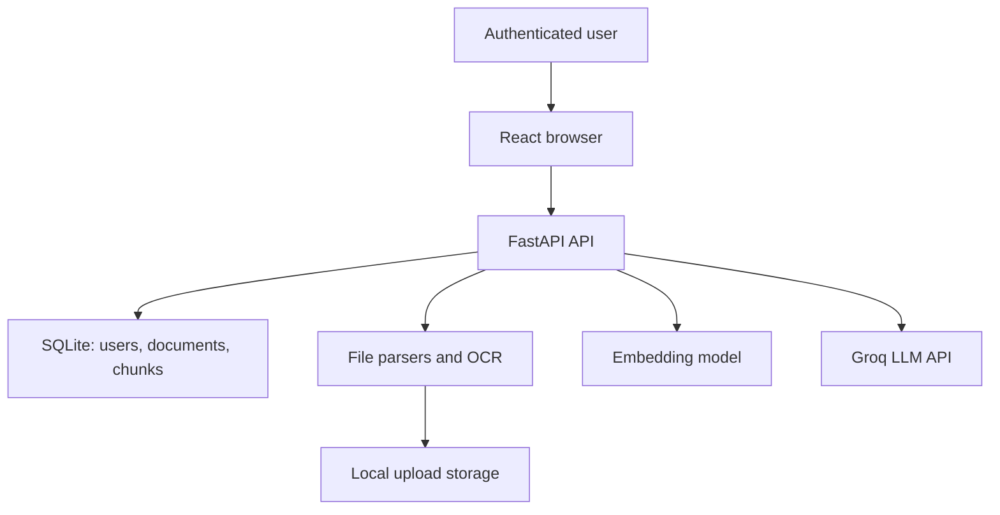

# RAG Demo — Production Security Assessment

**Repository assessed:** `github.com/Hariharan-Adev/Rag-demo` (commit `70aed9d`, `main`)

**Assessment date:** 22 July 2026  
**Method:** passive source-code, configuration, dependency-manifest, and test review. No deployment access, credential access, exploitation, or live attack was performed.

## Executive summary

The application has a useful secure-MVP base: Argon2 password hashing, JWT expiry, owner-scoped SQL queries, parameterized database access, randomized stored file names, path containment checks on deletion, request quotas, and privacy-aware audit logging.

It is **not ready for production** without remediation. The largest risks are resource-exhaustion through document parsers/OCR, incomplete authentication-abuse controls, and weak RAG prompt-injection handling that relies on bypassable keyword matching. Deployment controls (TLS, proxy configuration, security headers, secret rotation, backups, malware scanning, and monitoring) cannot be verified from this repository.

### Release decision

**Do not expose this service to untrusted internet users yet.** It is suitable only for a controlled internal pilot after the Critical and High findings below have owners and passing regression tests.

## Scope and constraints

| Item | Status |
|---|---|
| Backend API, frontend, configuration templates, dependency manifests | Assessed |
| Live production/staging configuration, cloud IAM, firewall/WAF, TLS, CI/CD, runtime secrets | Not assessed |
| Active red-team testing or file-fuzzing | Not performed — no written test authorization/scope |
| Source tenancy isolation | Verified in reviewed document/search/delete paths |
| Dependency vulnerability check | Frontend `npm audit --package-lock-only --omit=dev`: 0 findings; backend cannot be conclusively checked because `requirements.txt` has no resolved, pinned lockfile |

## Architecture and trust boundaries

The user question, uploaded files, extracted text, OCR output, retrieval results, and model response are untrusted data. The JWT is the identity boundary. `owner_id` filtering is the tenant boundary. The Groq API call is an external data-transfer boundary.

## Findings

| Priority | Finding | Evidence | Risk and required remediation |
|---|---|---|---|
| **Critical** | Parser/OCR resource exhaustion (zip/decompression bomb, oversized image, many GIF frames/pages/sheets) | `backend/app/routes/upload.py:196-269` reads up to 25 MB then stores and parses; `document_loader.py:25-223` has no page/sheet/frame/pixel/decompressed-size limits or parsing timeout. OOXML files are accepted based only on ZIP magic bytes. | A small crafted archive/image can consume CPU, memory, disk, or OCR time and deny service. Parse in an isolated worker/container with CPU/memory/wall-clock limits; enforce compressed and expanded archive limits, maximum pages/sheets/rows/slides/frames/pixels, and reject ZIP path/symlink anomalies before parsing. Add AV/CDR scanning and quarantine before persistence. |
| **High** | Prompt-injection defense is keyword denylisting rather than robust, layered risk control | `utils/security.py:9-54` rejects six regex families; `rag_service.py:40-48` adds delimiters and instruction text. Questions themselves are not assessed; retrieved text is sent to the provider. | Obfuscation, multilingual phrasing, encoded text, or indirect instructions can bypass the detector. Treat detection as telemetry only; preserve documents but label/quarantine suspicious content. Enforce deterministic retrieval/authorization; use a strict prompt contract with source citations and no tool capability; apply output policy checks; test direct/indirect, multilingual, encoded and multi-turn injections. |
| **High** | Login and registration abuse controls are missing | `routes/auth.py:23-89` has no rate limit, lockout/backoff, CAPTCHA/bot control, password breach screening, email verification, password reset, MFA, or session revocation. Registration returns `409` for a registered address. | Enables credential stuffing, unlimited account creation, and email enumeration. Add per-account and per-IP progressive throttling (at edge and app), generic registration response, verified email flow, password reset with one-time hashed tokens, optional MFA for privileged access, and a token version/denylist for logout and emergency revocation. |
| **High** | Security headers and production transport posture are not configured | `app/main.py:15-28` contains development-only CORS origins but no HTTPS redirect, HSTS, CSP, `X-Content-Type-Options`, clickjacking policy, trusted-proxy policy, or request-body limit at the reverse proxy. | Browser and deployment protections depend on unspecified infrastructure. Terminate TLS at a managed proxy, redirect HTTP, add security headers, configure exact production origins from environment, and trust forwarded client headers only from known proxies. Do not deploy with the listed localhost CORS values as the production configuration. |
| **High** | Dependency supply-chain controls are insufficiently reproducible | `backend/requirements.txt` uses broad version ranges/no hashes; no backend lockfile or SBOM is present. | A future install can resolve different code, including vulnerable versions. Pin and hash a tested dependency set, generate an SBOM, scan in CI, and define an update/patch SLA. Frontend production lockfile audit was clean at review time but does not cover Python. |
| **Medium** | Stored uploads are not cryptographically protected or malware-scanned | `database.py:14-15` stores under local `backend/data/uploads`; `upload.py:211-215` writes bytes before parsing. | Host, backup, or volume access exposes original documents. Use private object storage with service identity/least privilege, server-side encryption/KMS, retention/deletion policy, encrypted backups, malware scanning/quarantine, and no public serving path. |
| **Medium** | RAG outputs can be misleading and source provenance is weak | `rag_service.py:31-49,81-89` sends raw chunks and returns only filename/score; no citation-to-span validation, relevance threshold, or answer abstention based on score. | A user could make decisions from an answer unsupported by their documents. Require per-claim citations to chunk IDs/spans, minimum relevance thresholds, abstain on conflicts/low confidence, and add factual-grounding evaluations. |
| **Medium** | Error handling can disclose internal configuration state | `routes/chat.py:46-47` returns `str(error)` for `ValueError`, including missing-provider configuration. | Detailed runtime errors help attackers profile the system. Return generic client messages; log a correlation ID and sanitized error server-side. |
| **Medium** | Audit data has no demonstrated retention, integrity, alerting, or incident workflow | `utils/audit.py:16-41` writes mutable local SQLite records; no alert thresholds or review workflow is present. | Security events may be unavailable or altered after a compromise. Export structured minimal events to centralized, access-controlled, append-protected logging; define retention, alerts, and an incident runbook. |
| **Low** | Chat history persists in browser local storage | `frontend/src/context/AppContext.tsx:87-107,241-247`. | Another user/process with browser-profile access can read sensitive chat content. Make persistence opt-in, provide clear deletion, document the risk, and consider server-side encrypted history with retention controls for production. |

## Verified strengths

| Control | Evidence |
|---|---|
| Password hashing | `auth.py:11,24-30` uses `pwdlib` recommended Argon2 configuration. |
| Token expiry and algorithm allowlist | `auth.py:37-56` requires a configured signing key, uses `exp`, and decodes only `HS256`. |
| Tenant authorization for retrieval | `vector_search.py:30-42` filters both `documents.owner_id` and `document_contents.owner_id`. |
| Tenant authorization for deletion | `routes/documents.py:97-134` scopes select/delete/content cleanup to owner. |
| SQL injection resistance in reviewed paths | Query values use SQLite parameters. Dynamic SQL is constrained to a fixed internal column allowlist in `upload.py:45-60`. |
| File naming/path traversal mitigation | Random UUID storage names and resolved-path containment before deletion (`routes/documents.py:13-23`). |
| Abuse/cost guardrails | User/IP hourly limits and per-user daily LLM-call quota (`utils/rate_limit.py`). |
| Secret exclusion from Git | `.gitignore` excludes `.env`, database files, and uploads; checked tracked files did not include runtime secrets. |

## Priority remediation roadmap

### Immediate — 0–30 days (release blockers)

1. **Owner: Backend/Platform.** Move all parsing/OCR to a sandboxed worker with time, memory, CPU, and disk quotas; apply archive, page, image, sheet, row, slide, and frame caps before extraction. **Acceptance:** malicious ZIP/image/PDF corpus cannot exceed worker quotas and is quarantined with an audit event.
2. **Owner: Backend.** Replace regex-based blocking with a RAG policy pipeline: classify/flag suspicious content, strict source-bounded prompt, citation-required response schema, relevance threshold, and regression evaluations. **Acceptance:** all approved direct/indirect/multilingual/encoded injection tests result in no instruction following or cross-user disclosure.
3. **Owner: Identity/Platform.** Rate-limit register/login/reset at the reverse proxy and application, introduce progressive throttling, generic error messages, verified email, and token revocation. **Acceptance:** credential-stuffing simulation stays under defined limits; revoked tokens fail immediately.
4. **Owner: Platform.** Production reverse-proxy baseline: HTTPS-only, HSTS, CSP, frame protection, nosniff, exact environment-derived CORS, explicit trusted proxy list, request-size limits, WAF/bot protection. **Acceptance:** automated header/CORS tests pass in staging.
5. **Owner: Security/DevOps.** Pin/harden backend dependencies, generate SBOM, scan both ecosystems in CI, and block known critical/high findings under the agreed exception process. **Acceptance:** reproducible build and CI report attached to release.

### Short term — 31–90 days

- Store uploads in private encrypted object storage; add AV/CDR quarantine and retention/deletion/backup policy.
- Centralize immutable audit telemetry; alert on injection flags, parser failures, rate-limit spikes, login failures, cross-tenant authorization failures, and unusual token use.
- Add email verification, password reset, MFA/SSO according to user type, and administrator roles with explicit authorization tests.
- Create a security test suite: IDOR, JWT expiry/revocation, upload-bomb fixtures, format fuzzing, RAG injection corpus, tenant-isolation tests, and dependency/SAST checks.

### Long term — 90+ days

- Move from embedded SQLite to a managed database and background job queue with least-privilege service accounts, encryption/backup and HA design.
- Establish an AI governance register: data classification, provider/data-processing agreement, regional processing decision, retention, acceptable-use policy, model-change approval, evaluation gates, and incident exercises.
- Independently test the staging environment under written authorization before public release.

## Production gate checklist

- [ ] Deployment threat model and data classification approved by system owner.
- [ ] No secrets committed; secrets are in a managed vault and rotated.
- [ ] TLS, headers, trusted proxies, WAF/rate limits, and production CORS validated.
- [ ] Parser sandbox, scan/quarantine, and resource limits pass malicious-file regression tests.
- [ ] Tenant/IDOR and JWT revocation tests pass.
- [ ] Prompt-injection and grounding evaluation suite passes the agreed threshold.
- [ ] Central logs, alerts, retention, on-call owner, and incident response runbook exist.
- [ ] SBOM, dependency scans, tests, backup/restore test, and rollback plan are attached to release.

## Authorized red-team plan (not executed)

Use only a staging system, synthetic accounts/documents, a defined test window, and stop conditions. Test: (1) cross-account document/search/delete IDOR; (2) expired, malformed and revoked JWT behavior; (3) direct/indirect/multilingual/encoded prompt injection; (4) malicious archives/PDFs/images/OCR inputs within worker safety limits; (5) credential stuffing and quota bypass; (6) source-grounding and citation integrity. Never test real credentials, production data, persistence, denial of service, or exfiltration.

## Sources and framework mapping

- OWASP, *Top 10 for LLM Applications v2.0 (2025)* — prompt injection, sensitive disclosure, vector/embedding weaknesses, and unbounded consumption. Retrieved 22 July 2026. https://owasp.org/www-project-top-10-for-large-language-model-applications/assets/PDF/OWASP-Top-10-for-LLMs-v2025.pdf
- OWASP, *File Upload Cheat Sheet* — allowlists, signatures are insufficient alone, size limits, storage and malware controls. Retrieved 22 July 2026. https://cheatsheetseries.owasp.org/cheatsheets/File_Upload_Cheat_Sheet.html
- NIST, *AI RMF: Generative AI Profile (AI 600-1)*, 26 July 2024; page updated 8 April 2026 — governance, mapping, measurement, and management of GenAI risks. Retrieved 22 July 2026. https://www.nist.gov/publications/artificial-intelligence-risk-management-framework-generative-artificial-intelligence

This assessment maps primarily to OWASP LLM01/02/03/05/07/08/09/10 and NIST AI RMF Govern, Map, Measure, and Manage. It is a technical assessment, not a certification or compliance determination.
